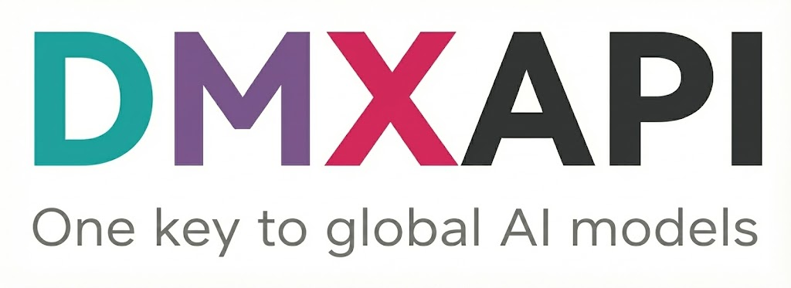

<p align="center">
  
</p>

<p align="center">
  <a href="https://github.com/chenhg5/cc-connect/actions/workflows/ci.yml">
    
  </a>
  <a href="https://github.com/chenhg5/cc-connect/releases">
    
  </a>
  <a href="https://www.npmjs.com/package/cc-connect">
    
  </a>
  <a href="https://github.com/chenhg5/cc-connect/blob/main/LICENSE">
    
  </a>
  <a href="https://goreportcard.com/report/github.com/chenhg5/cc-connect">
    
  </a>
</p>

<p align="center">
  <a href="https://discord.gg/kHpwgaM4kq">
    
  </a>
  <a href="https://t.me/+odGNDhCjbjdmMmZl">
    
  </a>
</p>

<p align="center">
  <a href="./README.md">English</a> | <a href="./README.zh-CN.md">中文</a>
</p>


## ❤️ Sponsor

> Want to appear here? Contact: chg80333@gmail.com | WeChat: mongorz

<details open>
<summary>Sponsors</summary>

[](https://platform.minimax.io/subscribe/token-plan?code=lqYrKBvjke&source=link)

MiniMax-M2.7 is a next-generation large language model designed for autonomous evolution and real-world productivity. Unlike traditional models, M2.7 actively participates in its own improvement through agent teams, dynamic tool use, and reinforcement learning loops. It delivers strong performance in software engineering (56.22% on SWE-Pro, 55.6% on VIBE-Pro, 57.0% on Terminal Bench 2) and excels in complex office workflows, achieving a leading 1495 ELO on GDPval-AA. With high-fidelity editing across Word, Excel, and PowerPoint, and a 97% adherence rate across 40+ complex skills, M2.7 sets a new standard for building AI-native workflows and organizations.

[Click here](https://platform.minimax.io/subscribe/token-plan?code=lqYrKBvjke&source=link) to get an exclusive 12% off the MiniMax Token Plan + voucher for cc-connect users!

---

<table>
<tr>
<td width="150"><a href="https://aigocode.com/invite/CYY3C85C"></a></td>
<td>Thanks to AIGoCode for sponsoring this project! AIGoCode is an all-in-one platform that integrates Claude Code, Codex, and the latest Gemini models, providing you with stable, efficient, and highly cost-effective AI coding services. The platform offers flexible subscription plans, zero risk of account suspension, direct access with no VPN required, and lightning-fast responses. AIGoCode has prepared a special benefit for cc-connect users: if you register via <a href="https://aigocode.com/invite/CYY3C85C">this link</a>, you'll receive an extra 10% bonus credit on your first top-up!</td>
</tr>

<tr>
<td width="150"><a href="https://www.dmxapi.cn/register?aff=NDln"></a></td>
<td>Thanks to DMXAPI for sponsoring this project! DMXAPI provides global large model API services to 200+ enterprise users. One API key for all global models. Features include: instant invoicing, unlimited concurrency, starting from $0.15, 24/7 technical support. GPT/Claude/Gemini all at 32% off, domestic models 20-50% off, Claude Code exclusive models at 66% off! Register via <a href="https://www.dmxapi.cn/register?aff=NDln">this link</a>.</td>
</tr>

<tr>
<td width="150"><a href="https://www.shengsuanyun.com/?from=CH_67XCLZGS"></a></td>
<td>Thanks to Shengsuanyun for sponsoring this project! Shengsuanyun is a super factory dedicated to serving AI Native Teams, an industrial-grade AI task parallel execution platform, and a model marketplace that aggregates and supplies computing power from domestic and international LLM and image/video multimedia models such as Claude, Chatgpt, and Gemini. It guarantees no reverse engineering or data manipulation, boasts a 99.7% SLA availability across the entire site, and its <a href="https://watch.shengsuanyun.com/status/shengsuanyun">monitoring interface</a> is consistently green. Furthermore, it offers an enterprise-grade customized gateway for refined cost and access control, featuring intelligent routing, security protection, and BYOK enterprise-provided key hosting. The platform is billed on a pay-as-you-go basis and with a tokens plan (coming soon), and invoices are available. New users who register using <a href="https://www.shengsuanyun.com/?from=CH_67XCLZGS">this link</a> will receive 10 yuan in model power and a 10% bonus on their first deposit.</td>
</tr>

<tr>
<td width="150"><a href="https://www.aicodemirror.com/register?invitecode=KDHMUP"></a></td>
<td>Thanks to AICodeMirror for sponsoring this project! AICodeMirror provides official high-stability relay services for Claude Code / Codex / Gemini CLI, with enterprise-grade concurrency, fast invoicing, and 24/7 dedicated technical support. Claude Code / Codex / Gemini official channels at 38% / 2% / 9% of original price, with extra discounts on top-ups! AICodeMirror offers special benefits for CC users: register via <a href="https://www.aicodemirror.com/register?invitecode=KDHMUP">this link</a> to enjoy 20% off your first top-up, and enterprise customers can get up to 25% off!</td>
</tr>

<tr>
<td width="150"><a href="https://code0.ai/register?aff=5cGO"></a></td>
<td>Thanks to Code0 for sponsoring this project! Code0 is an AI model aggregation API relay service for Chinese developers, compatible with OpenAI / Anthropic / Gemini protocols. One key for all mainstream models, stable support for Claude Code, Codex, Gemini CLI, cc-connect and more. Fixed exchange rate: ¥1.5 CNY = $1 USD API credit, transparent pricing, domestic direct connection, ready to use. Register via <a href="https://code0.ai/register?aff=5cGO">this link</a>.</td>
</tr>

<tr>
<td width="150"><a href="https://console.claudeapi.com/register?aff=GDbA"></a></td>
<td>Thanks to claudeapi.com for sponsoring this project! claudeapi is a high-quality direct Claude connection service for mid-to-high-end users. It is fully integrated with Anthropic's official first-party Keys and AWS Bedrock official channels — no reverse engineering, no intelligence degradation, no stitching. It fully preserves the official capabilities, long context, and tool-calling performance of Opus / Sonnet / Haiku. Designed specifically for Claude Code power users, Agent developers, and enterprise teams, it focuses on out-of-the-box usability and enterprise-grade stability. Invoicing and team onboarding are supported. Register via <a href="https://console.claudeapi.com/register?aff=GDbA">this link</a>.</td>
</tr>

<tr>
<td width="150"><a href="https://ddshub.short.gy/ccconnect"></a></td>
<td>Thanks to DDS for sponsoring this project! DDS Hub is a reliable and high-performance Claude and CodeX API proxy service. We provides cost-effective domestic Claude direct acceleration services for both individual and enterprise users. We offer stable and low-latency Claude Max number pools, with full support for Claude Haiku, Opus, Sonnet, GPT 5.4 and other flagship models. Invoices are available for recharges of 1000 RMB or more. Enterprise customers can also enjoy customized grouping and dedicated technical support services. Exclusive benefit for CC connect users: Register via <a href="https://ddshub.short.gy/ccconnect">this link</a> and enjoy an extra 10% credit on your first recharge (please contact the group admin to claim after recharging)!</td>
</tr>
</table>

</details>

---

<br>

<p align="center">
  <b>Control your local AI agents from any chat app. Anywhere, anytime.</b>
</p>

<p align="center">
  cc-connect bridges AI agents running on your machine to the messaging platforms you already use.<br/>
  Code review, research, automation, data analysis — anything an AI agent can do,<br/>
  now accessible from your phone, tablet, or any device with a chat app.
</p>

<p align="center">
  
</p>


## 🆕 What’s New in v1.1.1

- **Local Claude Terminal Bridge** — Run `cc-connect terminal claude` on your desktop, attach it from Feishu/Lark with `/terminal attach <id>`, and control the same visible Claude TUI from chat.
- **CLI ↔ Feishu synchronization fix** — Feishu messages and local desktop Claude TUI input now stay synchronized in both directions, including fresh attach, detach/reattach, and direct local CLI input.
- **Terminal screenshot-progress replies** — `/terminal mode screenshot-progress` sends progress screenshots for tool stages plus final screenshots after the terminal becomes idle.
- **Final-only terminal replies** — terminal replies wait until the terminal becomes idle, reducing missing tail output and suppressing transient Claude TUI status noise.
- **Multi-page terminal screenshots** — long terminal output is sent as ordered PNG pages so scrolled content is not lost.
- **Latest-turn screenshots** — `/terminal screenshot latest` captures only the latest/current turn, while `/terminal screenshot` keeps the current full terminal screen/history behavior.
- **Local desktop input feedback** — if you type directly into the local Claude TUI, the attached Feishu chat receives the result using the current reply mode.

## 🆕 What’s New in v1.3.0

- **🌐 Web Admin UI (Recommended)** — Full management dashboard embedded in the binary — **no extra dependencies**. Create and edit projects, manage providers, monitor sessions, edit cron jobs, and **chat with your agent directly from the browser**. Supports 5 languages (en/zh/zh-TW/ja/es). We recommend managing cc-connect through the web UI instead of editing `config.toml` by hand. Run `cc-connect web` to open it instantly.
- **Lifecycle Event Hooks** — New `[[hooks]]` config triggers shell commands or HTTP webhooks on message, session, cron, permission, and error events. Async by default, fail-open.
- **Skill Management** — New `/skills` page with local skill browser and recommended presets.
- **Global Provider Management** — Add/edit/delete providers in the web UI; import from cc-switch config.
- **Personal WeChat** — Chat with your local agent from **Weixin (personal)** via ilink long-polling; QR `weixin setup`, CDN media, no public IP. *[Setup → `docs/weixin.md`](docs/weixin.md)*
- **Weibo DM** — Chat with your agent via **Weibo private messages** over WebSocket; no public IP needed, text streaming supported.
- **Feishu Enhancements** — Auto-resolve `@name` mentions, multi-level reply chain recognition, done-emoji reactions.
- **New Agents** — Kimi CLI and Pi agent support added.


## 🧩 Platform feature snapshot

High-level view of what each **built-in platform** can do in cc-connect.

**Legend**

| Symbol | Meaning |
|--------|---------|
| ✅ | Works in **stable** cc-connect with typical configuration |
| ⚠️ | Partial, needs extra config (e.g. speech / ASR), or limited by the vendor app or API |
| ❌ | Not supported or not applicable in practice |

† **QQ (NapCat / OneBot)** — unofficial self-hosted bridge; behaviour depends on your NapCat / network setup.

| Capability | Feishu | DingTalk | Telegram | Slack | Discord | LINE | WeCom | Weibo | **Weixin**<br>*(personal)* | QQ† | QQ Bot |
|------------|:------:|:--------:|:--------:|:-----:|:-------:|:----:|:-----:|:-----:|:-------------------------:|:---:|:------:|
| Text & slash commands | ✅ | ✅ | ✅ | ✅ | ✅ | ✅ | ✅ | ✅ | ✅ | ✅ | ✅ |
| Markdown / cards | ✅ | ✅ | ✅ | ✅ | ✅ | ⚠️ | ⚠️ | ❌ | ✅ | ✅ | ✅ |
| Streaming / chunked replies | ✅ | ✅ | ✅ | ✅ | ✅ | ✅ | ✅ | ✅ | ✅ | ✅ | ✅ |
| Images & files | ✅ | ✅ | ✅ | ✅ | ✅ | ⚠️ | ✅ | ❌ | ✅ | ✅ | ✅ |
| Voice / STT / TTS | ⚠️ | ⚠️ | ✅ | ⚠️ | ⚠️ | ❌ | ⚠️ | ❌ | ✅ | ⚠️ | ⚠️ |
| Private (DM) | ✅ | ✅ | ✅ | ✅ | ✅ | ✅ | ✅ | ✅ | ✅ | ✅ | ✅ |
| Group / channel | ✅ | ✅ | ✅ | ✅ | ✅ | ⚠️ | ✅ | ❌ | ✅ | ✅ | ✅ |

> **WeCom:** Webhook mode needs a **public URL**; long-connection / WS style setups often do not.  
> **Voice row:** many platforms need `[speech]` / TTS providers enabled in `config.toml`; values are a best-effort summary.  
> Per-platform setup: [Platform setup guides](#-platform-setup-guides) below.


## ✨ Why cc-connect?

### 🤖 Universal Agent Support
**9+ AI Agents** — Claude Code, Codex, Cursor Agent, Kimi CLI, Qoder CLI, Gemini CLI, OpenCode, iFlow CLI, Pi — plus any agent that supports the [Agent Client Protocol (ACP)](https://agentclientprotocol.com/get-started/agents). Use whichever fits your workflow, or all of them at once.

### 📱 Platform Flexibility
**11 Chat Platforms** — Feishu, DingTalk, Slack, Telegram, Discord, WeChat Work, Weibo, LINE, QQ, QQ Bot (Official), plus **Weixin (personal ilink)** for **personal WeChat**. Most platforms need **zero public IP**.

### 🔄 Multi-Agent Orchestration
**Multi-Bot Relay** — Bind multiple bots in a group chat and let them communicate with each other. Ask Claude, get insights from Gemini — all in one conversation.

### 🎮 Complete Chat Control
**Full Control from Chat** — Switch models (`/model`), tune reasoning (`/reasoning`), change permission modes (`/mode`), manage sessions, all via slash commands.

**Directory Switching in Chat** — Change where the next session starts with `/dir <path>` (and `/cd <path>` as a compatibility alias), plus quick history jump via `/dir <number>` / `/dir -`.

### 🧠 Persistent Memory
**Agent Memory** — Read and write agent instruction files (`/memory`) without touching the terminal.

### ⏰ Intelligent Scheduling
**Scheduled Tasks** — Set up cron jobs in natural language. *"Every day at 6am, summarize GitHub trending"* just works.

### 🎤 Multimodal Support
**Voice & Images** — Send voice messages or screenshots; cc-connect handles STT/TTS and multimodal forwarding.

### 📦 Multi-Project Architecture
**Multi-Project** — One process, multiple projects, each with its own agent + platform combo.

### 🌍 Multilingual Interface
**5 Languages** — Native support for English, Chinese (Simplified & Traditional), Japanese, and Spanish. Built-in i18n ensures everyone feels at home.


<p align="center">
  
  
  
</p>
<p align="center">
  <em>Left：Lark &nbsp;|&nbsp; Telegram &nbsp;|&nbsp; Right：Wechat</em>
</p>


## 🚀 Quick Start

### 🤖 Install & Configure via AI Agent (Recommended)

> **The easiest way** — Send this to Claude Code or any AI coding agent, and it will handle the entire installation and configuration for you:

```bash
Follow https://raw.githubusercontent.com/chenhg5/cc-connect/refs/heads/main/INSTALL.md to install and configure cc-connect.
```


### 📦 Manual Install

**Via npm:**

```bash
npm install -g cc-connect
```

**Via Homebrew (macOS / Linux):**

```bash
brew install cc-connect
```

**Download binary from [GitHub Releases](https://github.com/chenhg5/cc-connect/releases):**

```bash
# Linux amd64 - Stable
curl -L -o cc-connect https://github.com/chenhg5/cc-connect/releases/latest/download/cc-connect-linux-amd64
chmod +x cc-connect
sudo mv cc-connect /usr/local/bin/

```

**Build from source (requires Go 1.22+):**

```bash
git clone https://github.com/chenhg5/cc-connect.git
cd cc-connect
make build
```


### ⚙️ Configure

> **💡 Tip: Use the Web UI to configure** — After installing, run `cc-connect web` to open the built-in management dashboard. You can visually create projects, add platforms, manage providers, and chat with your agent — no need to manually edit TOML files.

If you prefer manual configuration:

```bash
mkdir -p ~/.cc-connect
cp config.example.toml ~/.cc-connect/config.toml
vim ~/.cc-connect/config.toml
```

Set `admin_from = "alice,bob"` in a project to allow those user IDs to run privileged commands such as `/dir` and `/shell`.
When a user runs `/dir reset`, cc-connect restores the configured `work_dir` and clears the persisted override stored under `data_dir/projects/<project>.state.json`.


### ▶️ Run

```bash
./cc-connect
```


### 🖥️ Local Claude Terminal Bridge

Start the cc-connect daemon first, then open a local Claude terminal broker in the project directory you want to control:

```bash
cc-connect terminal claude --project ClaudeCode --workdir "/path/to/project" --data-dir "~/.cc-connect"
```

Windows example:

```powershell
.\cc-connect.exe terminal claude --project ClaudeCode --workdir "E:\\MyData\\Project" --data-dir "E:\\MyData\\ClaudeCode\\cc-connect\\.cc-connect"
```

The command prints a terminal ID such as `term_000001`. Attach to it from Feishu/Lark:

| Command | Purpose |
|---------|---------|
| `/terminal list` | List registered local terminal sessions. |
| `/terminal attach <id>` | Attach the current chat to a local terminal. Example: `/terminal attach term_000001`. |
| `/terminal detach` | Detach the chat from the current terminal. |
| `/terminal send <text>` | Send one command/message to the attached terminal. After attach, normal chat messages are also forwarded directly. |
| `/terminal mode` | Show the current reply mode. |
| `/terminal mode screenshot-progress` | Send progress screenshots for tool stages plus final screenshots. |
| `/terminal screenshot` | Send screenshots for the current full terminal screen/history. |
| `/terminal screenshot latest` | Send screenshots for only the latest/current turn. |

Notes:

- Screenshot mode sends multiple PNG pages when the terminal output scrolls beyond one visible screen.
- Local desktop input is reported back to the attached chat using the current mode.
- Raw local typed content is not echoed back as a Feishu message; only the resulting terminal output is delivered.


### 🔄 Upgrade

```bash
# npm
npm install -g cc-connect

# Homebrew
brew upgrade cc-connect

# Binary self-update
cc-connect update           # Stable
cc-connect update --pre     # Include pre-releases
```


## 📊 Support Matrix

| Component | Type | Status |
|-----------|------|--------|
| Agent | Claude Code | ✅ Supported |
| Agent | Codex (OpenAI) | ✅ Supported |
| Agent | Cursor Agent | ✅ Supported |
| Agent | Gemini CLI (Google) | ✅ Supported |
| Agent | Qoder CLI | ✅ Supported |
| Agent | OpenCode (Crush) | ✅ Supported |
| Agent | iFlow CLI | ✅ Supported |
| Agent | Kimi CLI (Moonshot) | ✅ Supported |
| Agent | Pi (Cursor Background Agent) | ✅ Supported |
| Agent | ACP (Agent Client Protocol) | ✅ Any [ACP-compatible agent](https://agentclientprotocol.com/get-started/agents) |
| Agent | Goose (Block) | 🔜 Planned |
| Agent | Aider | 🔜 Planned |
| Platform | Feishu (Lark) | ✅ WebSocket — no public IP needed |
| Platform | DingTalk | ✅ Stream — no public IP needed |
| Platform | Telegram | ✅ Long Polling — no public IP needed |
| Platform | Slack | ✅ Socket Mode — no public IP needed |
| Platform | Discord | ✅ Gateway — no public IP needed |
| Platform | Weibo | ✅ WebSocket — no public IP needed |
| Platform | LINE | ✅ Webhook — public URL required |
| Platform | WeChat Work | ✅ WebSocket / Webhook |
| Platform | Weixin (personal, ilink) | ✅— HTTP long polling — no public IP needed |
| Platform | QQ (NapCat/OneBot) | ✅ WebSocket |
| Platform | QQ Bot (Official) | ✅ WebSocket — no public IP needed |


## 📖 Platform Setup Guides

| Platform | Guide | Connection | Public IP? |
|----------|-------|------------|------------|
| Feishu (Lark) | [docs/feishu.md](docs/feishu.md) | WebSocket | No |
| DingTalk | [docs/dingtalk.md](docs/dingtalk.md) | Stream | No |
| Telegram | [docs/telegram.md](docs/telegram.md) | Long Polling | No |
| Slack | [docs/slack.md](docs/slack.md) | Socket Mode | No |
| Discord | [docs/discord.md](docs/discord.md) | Gateway | No |
| Weibo | [docs/weibo.md](docs/weibo.md) | WebSocket | No |
| WeChat Work | [docs/wecom.md](docs/wecom.md) | WebSocket / Webhook | No (WS) / Yes (Webhook) |
| Weixin (personal) | [docs/weixin.md](docs/weixin.md) | HTTP long polling (ilink) | No |
| QQ / QQ Bot | [docs/qq.md](docs/qq.md) | WebSocket | No |


## 🎯 Key Features

### 💬 Session Management

```
/new [name]       Start a new session
/list             List all sessions
/switch <id>      Switch session
/current          Show current session
/dir [path|reset] Show, switch, or reset work directory
```

Project configs can also rotate to a fresh session automatically after long inactivity:

```toml
[[projects]]
reset_on_idle_mins = 60
```


### 🛡️ OS-User Isolation (`run_as_user`)

On Linux/macOS, a project can spawn its agent under a different Unix
user for OS-level file-system isolation from the supervisor user that
runs cc-connect. Currently supported by Claude Code.

```toml
[[projects]]
name = "claude-sandboxed"
run_as_user = "partseeker-coder"
run_as_env = ["PGSSLROOTCERT"]
```

The target user needs passwordless sudo from the supervisor, no sudo
of its own, read+write on `work_dir`, and its own `~/.claude/settings.json`
with whatever credentials the agent uses. If you authenticate via
`claude.ai` OAuth, symlink the target user's `~/.claude/.credentials.json`
to the supervisor's copy so token refresh stays in sync — see the
[environment propagation checklist](./docs/usage.md#environment-propagation-what-moves-into-the-target-users-home)
for details. See
[`docs/usage.md`](./docs/usage.md#running-agents-as-a-different-unix-user-run_as_user)
for the full setup.

Before starting cc-connect, audit the setup with:

```bash
cc-connect doctor user-isolation
```

This runs three go/no-go preflight gates and an isolation probe that
reports what the target user can and cannot read. cc-connect refuses to
start if any gate fails or if the probe detects a cross-user leak.

---

### 🔐 Permission Modes

```
/mode             Show available modes
/mode yolo        # Auto-approve all tools
/mode default     # Ask for each tool
```


### 🔄 Provider Management

```
/provider list              List providers
/provider switch <name>     Switch API provider at runtime
```


### 🤖 Model Selection

```
/model                      List available models (format: alias - model)
/model switch <alias>       Switch to model by alias
```


### 📂 Work Directory

```
/dir                         Show current work directory and history
/dir <path>                  Switch to a path (relative or absolute)
/dir <number>                Switch from history
/dir -                       Switch to previous directory
/cd <path>                   Compatibility alias for /dir <path>
```


### ⏰ Scheduled Tasks

```bash
/cron add 0 6 * * * Summarize GitHub trending
```

### 📎 Agent Attachment Send-Back

When an agent generates a local screenshot, chart, PDF, bundle, or other file, it can send that attachment back to the current chat.

First release supports:
- Feishu
- Telegram

If your agent does not natively inject the system prompt, run this once in chat after upgrading:

```text
/bind setup
```

or:

```text
/cron setup
```

This refreshes the cc-connect instructions in the project memory file so the agent knows how to send attachments back.

You can control this feature globally in `config.toml`:

```toml
attachment_send = "on"  # default: "on"; set to "off" to block image/file send-back
```

This switch is independent from the agent's `/mode`. It only controls `cc-connect send --image/--file`.

Examples:

```bash
cc-connect send --image /absolute/path/to/chart.png
cc-connect send --file /absolute/path/to/report.pdf
cc-connect send --file /absolute/path/to/report.pdf --image /absolute/path/to/chart.png
```

Notes:
- Absolute paths are the safest option.
- `--image` and `--file` can both be repeated.
- `attachment_send = "off"` disables only attachment send-back; ordinary text replies still work.
- This command is for generated attachments, not ordinary text replies.

📖 **Full documentation:** [docs/usage.md](docs/usage.md)


## 📚 Documentation

- [Usage Guide](docs/usage.md) — Complete feature documentation
- [INSTALL.md](INSTALL.md) — AI-agent-friendly installation guide
- [config.example.toml](config.example.toml) — Configuration template
- [CONTRIBUTING.md](CONTRIBUTING.md) — How to report issues and contribute pull requests


## 👥 Community

- [Discord](https://discord.gg/kHpwgaM4kq)
- [Telegram](https://t.me/+odGNDhCjbjdmMmZl)


## ☕ Support the Project

If cc-connect has been helpful to you, consider buying us a coffee! Your support helps us:

- 🛠️ Maintain and improve the project
- 📚 Write better documentation and tutorials
- 🐛 Fix bugs and add new features faster
- ☕ Keep the developers caffeinated

### How to Donate

**Buy Me a Coffee**: [https://buymeacoffee.com/cg33](https://buymeacoffee.com/cg33)

**WeChat Pay / Alipay**:

| WeChat Pay | Alipay |
|:----------:|:------:|
|  |  |

### Thank You, Donors! 🎉

We're grateful to everyone who has supported this project. Leave your GitHub username in the donation message if you'd like to be recognized here!

<!-- Donors will be listed below -->
<!--
| GitHub Username | Date |
|-----------------|------|
| @username | YYYY-MM-DD |
-->


## 🤝 Commercial Cooperation

We accept the following commercial collaborations:

- **Enterprise Customization**: Custom deployment for internal AI tooling (Feishu, DingTalk, WeChat Work, Slack, etc.)
- **Technical Consulting**: AI agent integration and architecture design
- **Outsourcing Projects**: AI-related system development

**Contact**: **Email**: chg80333@gmail.com | **WeChat**: mongorz | [Telegram](https://t.me/+odGNDhCjbjdmMmZl) | [Discord](https://discord.gg/kHpwgaM4kq)


## 🙏 Contributors

<a href="https://github.com/chenhg5/cc-connect/graphs/contributors">
  
</a>


## ⭐ Star History

<a href="https://www.star-history.com/#chenhg5/cc-connect&Date">
 <picture>
   <source media="(prefers-color-scheme: dark)" srcset="https://api.star-history.com/svg?repos=chenhg5/cc-connect&type=Date&theme=dark" />
   <source media="(prefers-color-scheme: light)" srcset="https://api.star-history.com/svg?repos=chenhg5/cc-connect&type=Date" />
   
 </picture>
</a>


## 📄 License

MIT License


<p align="center">
  <sub>Built with ❤️ by the cc-connect community</sub>
</p>
