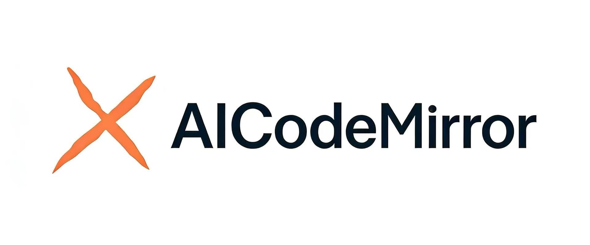
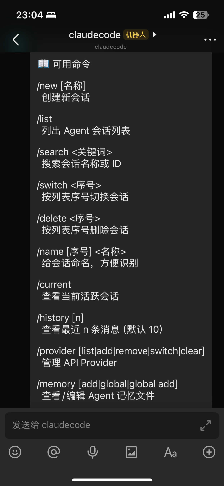
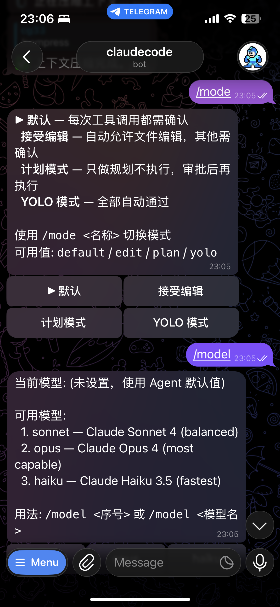

<p align="center">
  
</p>

<p align="center">
  <a href="https://github.com/chenhg5/cc-connect/actions/workflows/ci.yml">
    
  </a>
  <a href="https://github.com/chenhg5/cc-connect/releases">
    
  </a>
  <a href="https://www.npmjs.com/package/cc-connect">
    
  </a>
  <a href="https://github.com/chenhg5/cc-connect/blob/main/LICENSE">
    
  </a>
  <a href="https://goreportcard.com/report/github.com/chenhg5/cc-connect">
    
  </a>
</p>

<p align="center">
  <a href="https://discord.gg/kHpwgaM4kq">
    
  </a>
  <a href="https://t.me/+odGNDhCjbjdmMmZl">
    
  </a>
</p>

<p align="center">
  <a href="./README.md">English</a> | <a href="./README.zh-CN.md">中文</a>
</p>


## ❤️ 赞助

> 想在这里展示？联系：chg80333@gmail.com | 微信：mongorz

<details open>
<summary>赞助商</summary>

[](https://platform.minimaxi.com/subscribe/token-plan?code=HAvthxk1tT&source=link)

MiniMax M2.7 是 MiniMax 首个深度参与自我迭代的模型，可自主构建复杂 Agent Harness，并基于 Agent Teams、复杂 Skills、Tool Search Tool 等能力完成高复杂度生产力任务；其在软件工程、端到端项目交付及办公场景中表现优异，多项评测接近行业领先水平，同时具备稳定的复杂任务执行、环境交互能力以及良好的情商与身份保持能力。

[点击此处](https://platform.minimaxi.com/subscribe/token-plan?code=HAvthxk1tT&source=link)享 MiniMax Token Plan 专属 88 折优惠 + cc-connect 用户专属代金券！

---

<table>
<tr>
<td width="150"><a href="https://aigocode.com/invite/CYY3C85C"></a></td>
<td>感谢 AIGoCode 对本项目的赞助！AIGoCode 是集 Claude Code、Codex、最新 Gemini 模型于一体的一站式平台，提供稳定高效、高性价比的 AI 编码服务。灵活订阅方案、零封号风险、无需 VPN 直连、响应速度极快。通过 <a href="https://aigocode.com/invite/CYY3C85C">此链接</a> 注册，首充额外获得 10% 赠送额度！</td>
</tr>

<tr>
<td width="150"><a href="https://www.dmxapi.cn/register?aff=NDln"></a></td>
<td>感谢 DMXAPI（大模型API）赞助本项目！DMXAPI，一个 Key 用全球大模型。为 200+ 企业用户提供全球大模型 API 服务。充值即开票、当天开票、并发不限制、1元起充、7x24 在线技术辅导。GPT/Claude/Gemini 全部 6.8 折，国内模型 5~8 折，Claude Code 专属模型 3.4 折进行中！<a href="https://www.dmxapi.cn/register?aff=NDln">点击这里注册</a></td>
</tr>

<tr>
<td width="150"><a href="https://www.shengsuanyun.com/?from=CH_67XCLZGS"></a></td>
<td>感谢胜算云赞助了本项目！胜算云是专为 AI Native Teams 服务的超级工厂，工业级 AI 任务并行执行平台，模型商城集采直供聚合接入了 Claude、Chatgpt、Gemini 等海内外 LLM 及图片视频多媒体模型算力，绝无逆向掺水、全站模型 SLA 可用性高达 99.7%、<a href="https://watch.shengsuanyun.com/status/shengsuanyun">监测接口</a>日常全绿。更有企业级专属定制网关，实现团队精细化成本与权限管控，智能路由+安全防护+BYOK 企业自带密钥托管。平台按量及 tokens plan（即将上线）计费，可开票，使用<a href="https://www.shengsuanyun.com/?from=CH_67XCLZGS">此链接</a>注册新用户可获 10 元模力及首充 10% 赠送。</td>
</tr>

<tr>
<td width="150"><a href="https://www.aicodemirror.com/register?invitecode=KDHMUP"></a></td>
<td>感谢 AICodeMirror 对本项目的赞助！AICodeMirror 提供 Claude Code / Codex / Gemini CLI 官方高稳定性中转服务，企业级并发、快速开票、24小时专属技术支持。Claude Code / Codex / Gemini 官方渠道价格仅为原价的 38% / 2% / 9%，充值还有额外折扣！AICodeMirror 为 CC 用户专属福利：通过 <a href="https://www.aicodemirror.com/register?invitecode=KDHMUP">此链接</a> 注册首充享受 20% 折扣，企业客户最高可享 25% 折扣！</td>
</tr>

<tr>
<td width="150"><a href="https://code0.ai/register?aff=5cGO"></a></td>
<td>感谢 Code0 对本项目的赞助！Code0 是面向中国开发者的 AI 模型聚合 API 中转服务，统一兼容 OpenAI / Anthropic / Gemini 三种协议格式，一个 Key 即可调用全量主流模型，稳定适配 Claude Code、Codex、Gemini CLI、cc-connect 等各类 Agent 工具。固定汇率计费：充值 1.5 元人民币 = 1 美元 API 额度，价格透明、国内直连、开箱即用。通过 <a href="https://code0.ai/register?aff=5cGO">此链接</a> 注册。</td>
</tr>

<tr>
<td width="150"><a href="https://console.claudeapi.com/register?aff=GDbA"></a></td>
<td>感谢 claudeapi.com 对本项目的赞助！claudeapi 是面向中高端用户的高质量直连 Claude 服务，完整接入 Anthropic 官方第一方 Keys 和 AWS Bedrock 官方渠道——无逆向工程、无智力降级、无拼接。完整保留 Opus / Sonnet / Haiku 的官方能力、长上下文和 Tool Calling 性能。专为 Claude Code 重度用户、Agent 开发者和企业团队设计，开箱即用、企业级稳定。支持开票和团队入驻。通过 <a href="https://console.claudeapi.com/register?aff=GDbA">此链接</a> 注册。</td>
</tr>

<tr>
<td width="150"><a href="https://ddshub.short.gy/ccconnect"></a></td>
<td>感谢 DDS 赞助本项目！呆呆兽是一家专注 Claude 和 CodeX 的可靠高效 API 中转站，稳定运行、价格透明、开票便捷。为开发者提供高性价比的 AI 模型接入服务。通过 <a href="https://ddshub.short.gy/ccconnect">此链接</a> 注册。</td>
</tr>
</table>

</details>

---

<br>

<p align="center">
  <b>在任何聊天工具里，远程操控你的本地 AI Agent。随时随地，随心所欲。</b>
</p>

<p align="center">
  cc-connect 把运行在你机器上的 AI Agent 桥接到你日常使用的即时通讯工具。<br/>
  代码审查、资料研究、自动化任务、数据分析 —— 只要 AI Agent 能做的事，<br/>
  都能通过手机、平板或任何有聊天应用的设备来完成。
</p>

<p align="center">
  
</p>


## 🆕 v1.1.1 更新了什么

- **本地 Claude 终端桥接** — 在电脑端运行 `cc-connect terminal claude`，再从飞书/Lark 用 `/terminal attach <id>` 接入，即可远程控制同一个可见的 Claude TUI。
- **CLI ↔ 飞书双向同步修复** — 飞书消息和本地电脑端 Claude TUI 输入现在可以稳定双向同步，包括首次 attach、detach 后重新 attach，以及直接在本地 CLI 输入的场景。
- **终端过程截图回复** — `/terminal mode screenshot-progress` 会在工具执行阶段发送过程截图，并在终端静止后发送最终截图。
- **等待终端静止后再回复** — 终端回复会等终端无动态刷新后再发最终结果，减少少回复/丢尾部结果，并过滤 Roosting、Context、进度帧等动态噪声。
- **多页终端截图** — 终端输出超过一屏时会按顺序发送多张 PNG，避免只截到最后一页。
- **最新问答截图** — `/terminal screenshot latest` 只截最近/当前这一轮，`/terminal screenshot` 仍保留当前完整终端窗口/历史行为。
- **本地电脑端输入也会回传** — 直接在本地 Claude TUI 输入时，飞书会按当前 mode 收到这轮输出。

## 🆕 v1.3.0 更新了什么

- **🌐 Web 管理后台（推荐）** — 内置全功能可视化管理界面，**无需额外依赖**。支持项目增删改查、服务商管理、会话监控、定时任务编辑，还可以**直接在浏览器里和 Agent 对话**。支持 5 种语言 (en/zh/zh-TW/ja/es)。建议通过 Web UI 管理 cc-connect，无需手动编辑 `config.toml`。运行 `cc-connect web` 即可打开。
- **生命周期事件钩子** — 新增 `[[hooks]]` 配置，支持在消息收发、会话开始/结束、定时任务触发、权限请求、错误等事件时触发 Shell 命令或 HTTP Webhook。默认异步，失败不阻塞。
- **技能管理** — 新增 `/skills` 页面，支持本地技能浏览和推荐预设。
- **全局服务商管理** — 在 Web UI 中添加/编辑/删除 Provider，支持从 cc-switch 配置导入。
- **个人微信** — 用 **微信个人号（ilink 长轮询）** 和本地 Agent 对话；支持扫码 `weixin setup`、CDN 收发图片/文件，**无需公网 IP**。*[接入说明 → `docs/weixin.md`](docs/weixin.md)*
- **微博私信** — 通过 **微博私信** 与 Agent 对话，WebSocket 连接，无需公网 IP，支持流式文本回复。
- **飞书增强** — 自动解析 `@成员` 提及、多级回复链识别、完成 Emoji 反应。
- **新增 Agent** — 支持 Kimi CLI 和 Pi agent。


## 🧩 平台能力一览

内置各渠道在 cc-connect 里的大致能力对照，方便快速对比。

**图例**

| 符号 | 含义 |
|------|------|
| ✅ | **稳定版** cc-connect + 常规配置下可用 |
| ⚠️ | 部分支持、需额外配置（如语音/STT）或受厂商接口 / 应用类型限制 |
| ❌ | 不支持或实际不可用 |

† **QQ（NapCat / OneBot）** — 非官方自建桥接，体验依赖你的 NapCat 与网络环境。

| 能力 | 飞书 | 钉钉 | Telegram | Slack | Discord | LINE | 企业微信 | 微博 | **微信个人号**<br>（ilink） | QQ† | QQ 官方机器人 |
|------|:----:|:----:|:--------:|:-----:|:-------:|:----:|:--------:|:----:|:--------------------------:|:---:|:------------:|
| 文本与斜杠命令 | ✅ | ✅ | ✅ | ✅ | ✅ | ✅ | ✅ | ✅ | ✅ | ✅ | ✅ |
| Markdown / 卡片 | ✅ | ✅ | ✅ | ✅ | ✅ | ⚠️ | ⚠️ | ❌ | ✅ | ✅ | ✅ |
| 流式 / 分片回复 | ✅ | ✅ | ✅ | ✅ | ✅ | ✅ | ✅ | ✅ | ✅ | ✅ | ✅ |
| 图片与文件 | ✅ | ✅ | ✅ | ✅ | ✅ | ⚠️ | ✅ | ❌ | ✅ | ✅ | ✅ |
| 语音 / STT / TTS | ⚠️ | ⚠️ | ✅ | ⚠️ | ⚠️ | ❌ | ⚠️ | ❌ | ✅ | ⚠️ | ⚠️ |
| 私聊 | ✅ | ✅ | ✅ | ✅ | ✅ | ✅ | ✅ | ✅ | ✅ | ✅ | ✅ |
| 群聊 / 频道 | ✅ | ✅ | ✅ | ✅ | ✅ | ⚠️ | ✅ | ❌ | ✅ | ✅ | ✅ |

> **企业微信：** Webhook 模式需要**公网 URL**；长连接等模式多数**不需要**。  
> **语音行：** 多数平台要在 `config.toml` 里配置 `[speech]` / TTS 等，表中为经验性归纳。  
> 分平台接入步骤见下文 [平台接入指南](#-平台接入指南)。


## ✨ 为什么选择 cc-connect？

### 🤖 通用 Agent 支持
**9+ 大 AI Agent** — Claude Code、Codex、Cursor Agent、Kimi CLI、Qoder CLI、Gemini CLI、OpenCode、iFlow CLI、Pi，还可通过 [Agent Client Protocol (ACP)](https://agentclientprotocol.com/get-started/agents) 接入更多 Agent。按需选用，或同时使用全部。

### 📱 平台灵活性
**11 大聊天平台** — 飞书、钉钉、Slack、Telegram、Discord、企业微信、微博、LINE、QQ、QQ 官方机器人，以及 **微信个人号（ilink）**。大部分平台**无需公网 IP**。

### 🔄 多 Agent 编排
**多机器人中继** — 在群聊中绑定多个机器人，让它们相互协作。问 Claude，再听 Gemini 的见解 — 同一个对话搞定。

### 🎮 完整的聊天控制
**聊天即控制** — 切换模型 (`/model`)、切换推理强度 (`/reasoning`)、切换权限模式 (`/mode`)、管理会话，全部通过斜杠命令完成。

**聊天切换工作目录** — 使用 `/dir <路径>` 切换下一次会话启动目录（`/cd <路径>` 为兼容别名），并支持 `/dir <序号>` / `/dir -` 快速在历史目录间跳转。

### 🧠 持久化记忆
**Agent 记忆** — 在聊天中直接读写 Agent 指令文件 (`/memory`)，无需回到终端。

### ⏰ 智能定时任务
**定时任务** — 自然语言创建 cron 任务。"每天早上6点总结 GitHub trending" 即刻生效。

### 🎤 多模态支持
**语音 & 图片** — 发语音或截图，cc-connect 自动处理 STT/TTS 和多模态转发。

### 📦 多项目架构
**多项目管理** — 一个进程同时管理多个项目，各自独立的 Agent + 平台组合。

### 🌍 多语言界面
**5 种语言** — 原生支持英语、中文（简体/繁体）、日语和西班牙语。内置 i18n 让每个人都能得心应手。


<p align="center">
  
  
  
</p>
<p align="center">
  <em>左：飞书 &nbsp;|&nbsp; Telegram &nbsp;|&nbsp; 右：微信</em>
</p>


## 🚀 快速开始

### 🤖 通过 AI Agent 安装配置（推荐）

> **最简单的方式** — 把这段话发给 Claude Code 或其他 AI 编码 Agent，它会帮你完成整个安装和配置过程：

```bash
请参考 https://raw.githubusercontent.com/chenhg5/cc-connect/refs/heads/main/INSTALL.md 帮我安装和配置 cc-connect
```


### 📦 手动安装

**通过 npm：**

```bash
# npm install -g cc-connect
```

**通过 Homebrew（macOS / Linux）：**

```bash
brew install cc-connect
```

**从 [GitHub Releases](https://github.com/chenhg5/cc-connect/releases) 下载：**

```bash
# Linux amd64 - 稳定版
curl -L -o cc-connect https://github.com/chenhg5/cc-connect/releases/latest/download/cc-connect-linux-amd64
chmod +x cc-connect
sudo mv cc-connect /usr/local/bin/

```

**从源码编译（需要 Go 1.22+）：**

```bash
git clone https://github.com/chenhg5/cc-connect.git
cd cc-connect
make build
```


### ⚙️ 配置

> **💡 推荐使用 Web UI 配置** — 安装完成后，运行 `cc-connect web` 打开内置管理后台。可以可视化创建项目、添加平台、管理服务商、直接和 Agent 聊天，无需手动编辑 TOML 文件。

如果你更喜欢手动配置：

```bash
mkdir -p ~/.cc-connect
cp config.example.toml ~/.cc-connect/config.toml
vim ~/.cc-connect/config.toml
```

在项目配置里设置 `admin_from = "alice,bob"` 后，只有这些用户 ID 才能执行 `/dir`、`/shell` 等特权命令。
执行 `/dir reset` 时，cc-connect 会恢复配置中的 `work_dir`，并清除保存在 `data_dir/projects/<project>.state.json` 里的目录覆盖状态。


### ▶️ 运行

```bash
./cc-connect
```


### 🖥️ 本地 Claude 终端桥接

先启动 cc-connect daemon，再在要调试的项目目录启动本地 Claude 终端 broker：

```bash
cc-connect terminal claude --project ClaudeCode --workdir "/path/to/project" --data-dir "~/.cc-connect"
```

Windows 示例：

```powershell
.\cc-connect.exe terminal claude --project ClaudeCode --workdir "E:\\MyData\\Project" --data-dir "E:\\MyData\\ClaudeCode\\cc-connect\\.cc-connect"
```

命令会打印一个终端 ID，例如 `term_000001`。然后在飞书/Lark 中接入：

| 指令 | 作用 |
|------|------|
| `/terminal list` | 查看当前已注册的本地终端。 |
| `/terminal attach <id>` | 将当前聊天接入本地终端，例如 `/terminal attach term_000001`。 |
| `/terminal detach` | 断开当前聊天和终端的绑定。 |
| `/terminal send <内容>` | 向已接入终端发送一条消息/命令。接入后，普通聊天消息也会直接转发到终端。 |
| `/terminal mode` | 查看当前终端回复模式。 |
| `/terminal mode screenshot-progress` | 工具执行阶段发送过程截图，结束后发送最终截图。 |
| `/terminal screenshot` | 截取当前完整终端窗口/历史。 |
| `/terminal screenshot latest` | 只截取最近/当前这一轮问答。 |

说明：

- 终端输出超过一屏时，截图模式会按阅读顺序发送多张 PNG。
- 在电脑端直接输入 Claude TUI，也会按当前 mode 把结果回传到已接入的飞书聊天。
- 本地输入的原文不会被回显到飞书；飞书收到的是终端处理后的输出结果。


### 🔄 升级

```bash
# npm
npm install -g cc-connect

# Homebrew
brew upgrade cc-connect

# 二进制自更新
cc-connect update           # 稳定版
cc-connect update --pre     # 含预发布版本
```


## 📊 支持状态

| 组件 | 类型 | 状态 |
|------|------|------|
| Agent | Claude Code | ✅ 已支持 |
| Agent | Codex (OpenAI) | ✅ 已支持 |
| Agent | Cursor Agent | ✅ 已支持 |
| Agent | Gemini CLI (Google) | ✅ 已支持 |
| Agent | Qoder CLI | ✅ 已支持 |
| Agent | OpenCode (Crush) | ✅ 已支持 |
| Agent | iFlow CLI | ✅ 已支持 |
| Agent | Kimi CLI (Moonshot) | ✅ 已支持 |
| Agent | Pi (Cursor Background Agent) | ✅ 已支持 |
| Agent | ACP (Agent Client Protocol) | ✅ 支持任何 [ACP 兼容 Agent](https://agentclientprotocol.com/get-started/agents) |
| Agent | Goose (Block) | 🔜 计划中 |
| Agent | Aider | 🔜 计划中 |
| Platform | 飞书 (Lark) | ✅ WebSocket — 无需公网 IP |
| Platform | 钉钉 | ✅ Stream — 无需公网 IP |
| Platform | Telegram | ✅ Long Polling — 无需公网 IP |
| Platform | Slack | ✅ Socket Mode — 无需公网 IP |
| Platform | Discord | ✅ Gateway — 无需公网 IP |
| Platform | 微博 | ✅ WebSocket — 无需公网 IP |
| Platform | LINE | ✅ Webhook — 需要公网 URL |
| Platform | 企业微信 | ✅ WebSocket / Webhook |
| Platform | 微信个人号（ilink） | ✅— HTTP 长轮询 — 无需公网 IP |
| Platform | QQ (NapCat/OneBot) | ✅ WebSocket |
| Platform | QQ 官方机器人 | ✅ WebSocket — 无需公网 IP |


## 📖 平台接入指南

| 平台 | 指南 | 连接方式 | 需要公网 IP? |
|------|------|---------|-------------|
| 飞书 (Lark) | [docs/feishu.md](docs/feishu.md) | WebSocket | 不需要 |
| 钉钉 | [docs/dingtalk.md](docs/dingtalk.md) | Stream | 不需要 |
| Telegram | [docs/telegram.md](docs/telegram.md) | Long Polling | 不需要 |
| Slack | [docs/slack.md](docs/slack.md) | Socket Mode | 不需要 |
| Discord | [docs/discord.md](docs/discord.md) | Gateway | 不需要 |
| 微博 | [docs/weibo.md](docs/weibo.md) | WebSocket | 不需要 |
| 企业微信 | [docs/wecom.md](docs/wecom.md) | WebSocket / Webhook | 不需要 (WS) / 需要 (Webhook) |
| 微信个人号（ilink） | [docs/weixin.md](docs/weixin.md) | HTTP 长轮询（ilink） | 不需要 |
| QQ / QQ 机器人 | [docs/qq.md](docs/qq.md) | WebSocket | 不需要 |


## 🎯 核心功能

### 💬 会话管理

```
/new [名称]            创建新会话
/list                  列出所有会话
/switch <id>           切换会话
/current               查看当前会话
/dir [路径|reset]      查看、切换或重置工作目录
```

项目配置也可以开启“长时间空闲后自动切到新会话”：

```toml
[[projects]]
reset_on_idle_mins = 60
```


### 🛡️ 系统用户隔离 (`run_as_user`)

在 Linux/macOS 上，项目可以用另一个 Unix 用户身份启动 Agent，从而在操作系统层面实现文件系统隔离。目前 Claude Code 已支持。

```toml
[[projects]]
name = "claude-sandboxed"
run_as_user = "partseeker-coder"
run_as_env = ["PGSSLROOTCERT"]
```

目标用户需要：supervisor 对其配置免密 sudo、自身不拥有 sudo、对 `work_dir` 有读写权限、拥有自己的 `~/.claude/settings.json`。
如果你通过 `claude.ai` OAuth 认证，请将目标用户的 `~/.claude/.credentials.json` 软链接到 supervisor 的副本以保持 token 同步 —— 详见[环境传播清单](./docs/usage.md#environment-propagation-what-moves-into-the-target-users-home)。
完整设置说明见 [`docs/usage.md`](./docs/usage.md#running-agents-as-a-different-unix-user-run_as_user)。

启动 cc-connect 之前，可用以下命令审核配置：

```bash
cc-connect doctor user-isolation
```

该命令会执行三项前置检查和一次隔离探测，报告目标用户能/不能读取的内容。如果任一检查失败或探测到跨用户泄漏，cc-connect 将拒绝启动。

---

### 🔐 权限模式

```
/mode             查看可用模式
/mode yolo        # 自动批准所有工具
/mode default     # 每次工具调用前询问
```


### 🔄 Provider 管理

```
/provider list              列出 Provider
/provider switch <名称>     运行时切换 API Provider
```


### 🤖 模型选择

```
/model                      列出可用模型（格式：alias - model）
/model switch <alias>       按别名切换模型
```


### 📂 工作目录

```
/dir                         查看当前工作目录与历史
/dir <路径>                  切换到指定目录（相对或绝对路径）
/dir <序号>                  按历史序号切换
/dir -                       返回上一个目录
/cd <路径>                   `/dir <路径>` 的兼容别名
```


### ⏰ 定时任务

```bash
/cron add 0 6 * * * 帮我总结 GitHub trending
```

### 📎 Agent 回传图片和文件

当 Agent 在本地生成了截图、图表、PDF、日志包等文件时，可以主动把附件发回当前聊天。

首版支持：
- 飞书
- Telegram

如果当前 Agent 不是原生注入 system prompt 的类型，升级后请先在聊天里执行一次：

```text
/bind setup
```

或：

```text
/cron setup
```

这样会把最新的 cc-connect 指令写入项目记忆文件，Agent 才会知道如何回传附件。

你也可以在 `config.toml` 里全局控制这项能力：

```toml
attachment_send = "on"  # 默认 "on"；设为 "off" 会禁用图片/文件回传
```

这个开关与 agent 的 `/mode` 独立，只控制 `cc-connect send --image/--file` 这条附件回传路径。

回传方式：

```bash
cc-connect send --image /absolute/path/to/chart.png
cc-connect send --file /absolute/path/to/report.pdf
cc-connect send --file /absolute/path/to/report.pdf --image /absolute/path/to/chart.png
```

要点：
- 使用绝对路径最稳妥。
- `--image` 和 `--file` 都可以重复传多个。
- `attachment_send = "off"` 只会关闭附件回传，普通文本回复仍然正常。
- 这个命令是给“生成后的附件回传”用的，不是给普通文本回复用的。

📖 **完整文档：** [docs/usage.zh-CN.md](docs/usage.zh-CN.md)


## 📚 文档

- [使用指南](docs/usage.zh-CN.md) — 完整功能文档
- [INSTALL.md](INSTALL.md) — AI Agent 友好的安装指南
- [config.example.toml](config.example.toml) — 配置模板
- [CONTRIBUTING.md](CONTRIBUTING.md) — Issue / PR 提交流程与贡献说明


## 👥 社区

- [Discord](https://discord.gg/kHpwgaM4kq)
- [Telegram](https://t.me/+odGNDhCjbjdmMmZl)


## ☕ 支持项目

如果 cc-connect 对你有帮助，请考虑请我们喝杯咖啡！你的支持帮助我们：

- 🛠️ 维护和改进项目
- 📚 编写更好的文档和教程
- 🐛 更快修复 bug 和添加新功能
- ☕ 让开发者保持精力充沛

### 捐赠方式

**Buy Me a Coffee**：[https://buymeacoffee.com/cg33](https://buymeacoffee.com/cg33)

**微信支付 / 支付宝**：

| 微信支付 | 支付宝 |
|:----------:|:------:|
|  |  |

### 感谢捐赠者！🎉

感谢每一位支持这个项目的朋友。捐赠时留言你的 GitHub 用户名，我们会在这里展示！

<!-- 捐赠者名单 -->
<!--
| GitHub 用户名 | 日期 |
|-----------------|------|
| @username | YYYY-MM-DD |
-->


## 🤝 商业合作

我们接受以下商业合作：

- **企业定制**：为企业定制内部 AI 工具入口（飞书、钉钉、企业微信、Slack 等）
- **技术咨询**：AI agent 集成方案设计与架构咨询
- **外包项目**：AI 相关系统开发

**联系方式**：**邮箱**：chg80333@gmail.com | **微信**：mongorz | [Telegram](https://t.me/+odGNDhCjbjdmMmZl) | [Discord](https://discord.gg/kHpwgaM4kq)


## 🙏 贡献者

<a href="https://github.com/chenhg5/cc-connect/graphs/contributors">
  
</a>


## ⭐ Star History

<a href="https://www.star-history.com/#chenhg5/cc-connect&Date">
 <picture>
   <source media="(prefers-color-scheme: dark)" srcset="https://api.star-history.com/svg?repos=chenhg5/cc-connect&type=Date&theme=dark" />
   <source media="(prefers-color-scheme: light)" srcset="https://api.star-history.com/svg?repos=chenhg5/cc-connect&type=Date" />
   
 </picture>
</a>


## 📄 License

MIT License


<p align="center">
  <sub>由 cc-connect 社区用 ❤️ 构建</sub>
</p>
